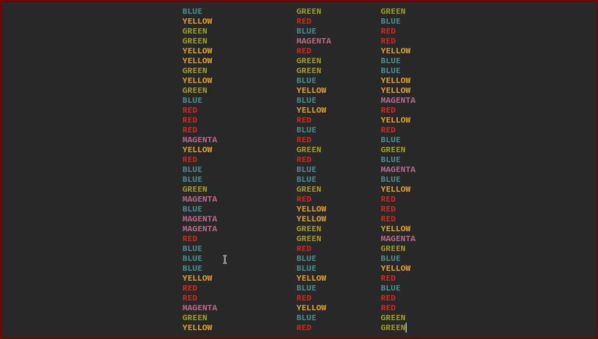
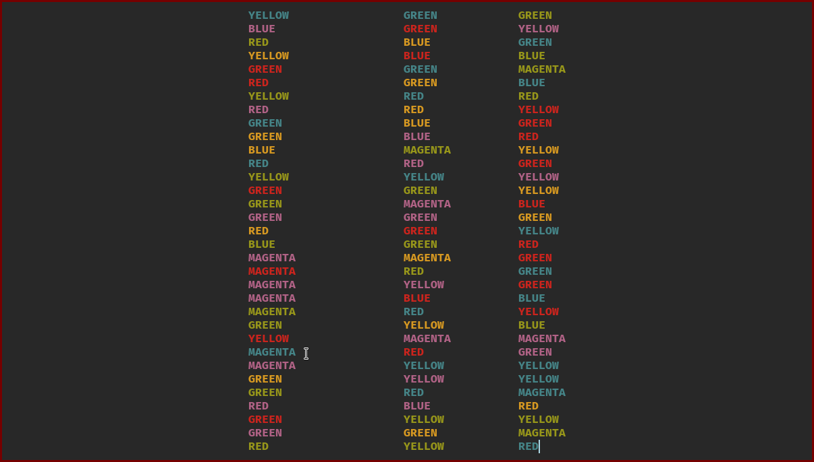

# Images

# How to Play:
You will be shown three screens. The first prompts you to read these rules. The second displays three rows of color words, written in their designated color (e.g. "RED" written in red, "BLUE" in blue, &c.). The latter screen displays the same three rows, except the words and the colors they're written in are discordant (e.g. "RED" written in green, "BLUE" written in magenta, &c.).

Read each column from top to bottom, left to right. Read aloud the color in which the given word is written, not the color itself (this is where the difficulty of the game comes from). e.g., "RED" written in green should be read aloud as "green." This will be considerably easier on the first screen than the second screen.

After playing, the game will present the amount of seconds you took to read each screen, and then the ratio between the latter and the former. Since the latter should take longer, the ratio is a rough measure of how strong your mind is at isolating attention and focus in a given moment.
